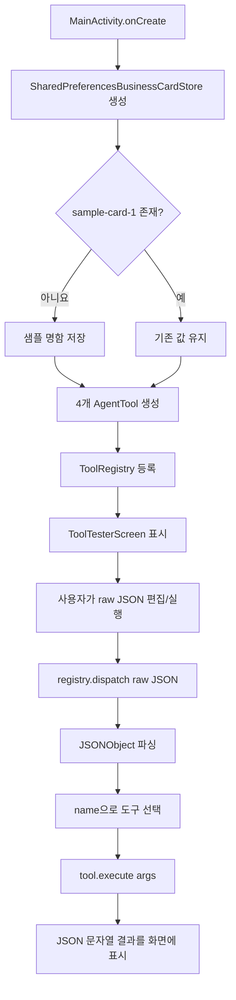
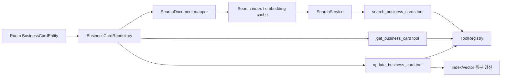

# sojung Android 프로젝트 상세 분석

> 분석 기준: 2026-07-03 (KST)
> 저장소: `https://github.com/HJP-limited/sojung.git`
> 브랜치: `android-app`
> 커밋: `993a5f5613235c2192f6c34b06841319813aefeb` (`Improve tool tester button layout`)

## 1. 결론 요약

`sojung`의 `android-app` 브랜치는 Kotlin/Jetpack Compose로 만든 **에이전트 도구 계층 검증용 Android 프로토타입**이다. README가 설명하는 최종 제품 전체가 구현된 상태는 아니다.

현재 실제로 동작하도록 작성된 범위는 다음 네 도구와 수동 테스트 화면이다.

1. `create_calendar_event`: 외부 캘린더 앱의 일정 작성 화면 열기
2. `open_compose`: 외부 이메일/SMS 앱의 작성 화면 열기
3. `update_business_card`: SharedPreferences의 샘플 명함 수정
4. `get_current_datetime`: 지정 또는 기기 시간대의 현재 시각 반환

앱 시작 시 `MainActivity`가 위 도구를 `ToolRegistry`에 등록한다. 사용자는 Compose 화면에서 LLM tool call 형태의 JSON을 직접 편집하고 실행할 수 있다. 실제 LLM, ReAct loop, OCR/KIE, 명함 이미지 등록, 검색, Room DB, 모델 추론은 아직 없다.

구조는 도구 인터페이스와 저장소 인터페이스를 분리했다는 점에서 확장 기반이 명확하다. 반면 production 기준으로는 개인정보 평문 저장/백업 정책, 입력 schema 검증 부재, 예외 격리 부재, 실제 기능 테스트 부재를 먼저 해결해야 한다.

## 2. 현재 구현 범위와 계획의 구분

### 구현됨

- 단일 Android `app` 모듈
- Kotlin + Jetpack Compose UI
- `AgentTool` 공통 인터페이스
- JSON declaration 생성과 이름 기반 dispatch를 담당하는 `ToolRegistry`
- 캘린더 작성 Intent
- 이메일/SMS 작성 Intent
- 명함 필드 수정 도구
- 현재 날짜/시각 조회 도구
- `BusinessCardStore` 추상화
- SharedPreferences 기반 임시 저장소와 샘플 명함 1건
- LLM 없이 raw tool call을 실행하는 테스트 UI

### README에는 방향/후보로 있으나 구현되지 않음

- Single ReAct Agent loop
- 온디바이스 LLM 또는 LiteRT-LM 연동
- Gemma/Gemini Nano/Qwen 계열 모델 로딩·추론
- FunctionGemma 기반 라우팅/파인튜닝
- EmbeddingGemma/KURE/KoE5/BGE/Qwen 임베딩
- 카메라/갤러리 기반 명함 이미지 등록
- OCR/KIE 및 필드 추출
- 명함 검색 도구와 단건 상세 조회 도구
- Room/실제 DB
- Gmail/Calendar API 직접 연동
- 목표 9개 도구 중 나머지 5개
- 사용자용 명함 관리 화면
- 모델/도구 orchestration용 ViewModel 또는 서비스

README의 모델 이름과 SDK는 모두 **후보 또는 검토 방향**이다. 현재 Gradle 의존성에는 ML/LLM/OCR/DB/네트워크 라이브러리가 없다.

## 3. 기술 스택과 빌드 설정

| 항목 | 현재 설정 |
|---|---|
| 프로젝트명 | `HJP` |
| 모듈 | `:app` 1개 |
| 언어 | Kotlin |
| UI | Jetpack Compose + Material 3 |
| Gradle wrapper | 9.4.1 |
| Android Gradle Plugin | 9.2.1 |
| Kotlin Compose plugin | 2.2.10 |
| Gradle daemon JVM criteria | 21 |
| Java source/target compatibility | 11 |
| compile SDK | Android 36, minor API 1 |
| target SDK | 36 |
| min SDK | 24 |
| application ID / namespace | `com.example.hjp` |
| version | `1.0` (`versionCode=1`) |
| Compose BOM | `2026.02.01` |

주요 AndroidX 버전:

| 라이브러리 | 버전 |
|---|---:|
| Core KTX | 1.10.1 |
| Lifecycle Runtime KTX | 2.6.1 |
| Activity Compose | 1.8.0 |
| JUnit 4 | 4.13.2 |
| AndroidX JUnit | 1.1.5 |
| Espresso | 3.5.1 |

Compose는 BOM으로 관리하지만 Core/Lifecycle/Activity/Test 의존성은 별도 고정 버전이다. 앱은 `kotlinx.coroutines.launch`를 사용하지만 coroutines를 직접 선언하지 않고 AndroidX의 전이 의존성에 기대고 있다. 사용 API는 직접 의존성으로 선언하는 편이 안전하다.

release build는 `optimization.enable = false`로 설정되어 있으며 별도 서명, 난독화, shrinker, product flavor 설정은 없다.

## 4. 디렉터리와 책임

```text
sojung/
├── app/
│   ├── build.gradle.kts
│   └── src/
│       ├── main/
│       │   ├── AndroidManifest.xml
│       │   ├── java/com/example/hjp/
│       │   │   ├── MainActivity.kt
│       │   │   ├── agent/tools/
│       │   │   │   ├── AgentTool.kt
│       │   │   │   ├── ToolRegistry.kt
│       │   │   │   ├── CreateCalendarEventTool.kt
│       │   │   │   ├── OpenComposeTool.kt
│       │   │   │   ├── UpdateBusinessCardTool.kt
│       │   │   │   └── GetCurrentDateTimeTool.kt
│       │   │   ├── data/
│       │   │   │   ├── BusinessCard.kt
│       │   │   │   └── SharedPreferencesBusinessCardStore.kt
│       │   │   └── ui/theme/
│       │   └── res/
│       ├── test/
│       └── androidTest/
├── gradle/libs.versions.toml
├── gradle/gradle-daemon-jvm.properties
├── gradle/wrapper/gradle-wrapper.properties
├── build.gradle.kts
├── settings.gradle.kts
├── README.md
└── CLAUDE.md
```

책임 경계:

- `agent/tools`: LLM에 노출할 function declaration과 side effect 실행
- `data`: 명함 모델과 저장소 contract/임시 구현
- `MainActivity`: 객체 조립(composition root)과 테스트 UI
- `ui/theme`: Android Studio 기본 Compose 테마
- `AndroidManifest.xml`: launcher 및 외부 앱 Intent query 선언

## 5. 앱 시작과 실행 흐름



`MainActivity`는 별도 DI framework 없이 저장소와 도구를 직접 생성한다. 현재 규모에서는 단순하지만, Activity 재생성 때 registry와 저장소 wrapper도 다시 만들어진다. SharedPreferences 데이터는 유지되지만 화면의 JSON/결과 상태는 `remember`만 사용하므로 구성 변경 시 복원되지 않는다.

도구 실행은 `rememberCoroutineScope().launch`로 시작하며 기본적으로 UI scope에서 진행된다. 현재 작업은 작지만 저장소가 Room/파일/모델 추론으로 교체되면 dispatcher와 lifecycle 책임을 ViewModel/use case 계층으로 옮겨야 한다.

## 6. AgentTool contract와 ToolRegistry

### 6.1 공통 contract

모든 도구는 다음 세 항목을 제공한다.

```kotlin
interface AgentTool {
    val name: String
    val declaration: JSONObject
    suspend fun execute(args: JSONObject): String
}
```

- `name`: LLM tool call에서 사용할 식별자
- `declaration`: JSON Schema와 유사한 function declaration
- `execute`: JSON 인자를 받아 LLM에 돌려줄 JSON 문자열 생성

`ToolResults.success/error`는 공통 `status`와 `message`를 만든다. 다만 구조가 Kotlin type으로 강제되지 않고 문자열로 반환되며, `update_business_card`와 `get_current_datetime`은 별도로 `data`를 추가한다.

### 6.2 등록과 dispatch

`ToolRegistry`는 vararg 도구를 `associateBy { it.name }`으로 Map에 넣는다.

실행 경로는 두 가지다.

1. `dispatch(name, args)`: 이름으로 바로 실행
2. `dispatch(rawToolCall)`: raw 문자열을 `JSONObject`로 파싱하고 `name`, `args`를 꺼낸 뒤 실행

오류로 JSON을 반환하는 경우:

- raw 문자열이 유효한 JSON이 아님
- `name` 누락/공백
- 등록되지 않은 도구 이름

중요한 한계:

- declaration은 LLM 안내용일 뿐 runtime schema validation에 사용되지 않는다.
- `args`가 객체가 아니면 오류가 아니라 빈 `JSONObject`로 대체된다.
- 같은 이름의 도구를 둘 이상 등록하면 마지막 항목이 조용히 앞 항목을 덮어쓴다.
- `tool.execute()`가 던지는 예외를 registry가 잡지 않는다. 주석의 “실패는 JSON으로 반환” 원칙은 각 도구가 완벽히 예외를 막는다는 가정에 의존한다.
- 도구 결과 JSON의 공통 typed model, version, request ID, trace ID가 없다.

## 7. 도구별 상세 분석

### 7.1 create_calendar_event

목적은 CalendarProvider에 직접 저장하는 것이 아니라 `Intent.ACTION_INSERT`로 외부 캘린더의 작성 화면을 여는 것이다.

| 인자 | declaration | 실제 runtime 처리 |
|---|---|---|
| `title` | 필수 string | 공백이면 오류 |
| `start_time` | 필수 string | 두 날짜 패턴 중 하나로 파싱 실패 시 오류 |
| `end_time` | 선택 string | 생략 시 시작 + 1시간 |
| `location` | 선택 string | 비어 있지 않으면 Intent extra |
| `description` | 선택 string | 비어 있지 않으면 Intent extra |
| `attendee_emails` | 선택 string array | 각 원소를 쉼표로 연결해 `Intent.EXTRA_EMAIL`에 저장 |

허용 패턴:

```text
yyyy-MM-dd'T'HH:mm:ss
yyyy-MM-dd'T'HH:mm
```

동작:

1. 시작/종료 시각을 기기 기본 시간대로 epoch milliseconds로 변환한다.
2. 종료가 시작보다 빠르면 오류를 반환한다.
3. `CalendarContract.Events.CONTENT_URI`를 가진 insert Intent를 구성한다.
4. application context에서 실행하므로 `FLAG_ACTIVITY_NEW_TASK`를 추가한다.
5. 외부 캘린더가 열리면 “화면을 열었다”고만 응답한다.

설계상 좋은 점:

- `WRITE_CALENDAR` 권한이 필요하지 않다.
- 사용자가 외부 앱에서 내용을 검토하고 최종 저장한다.
- 도구가 실제 저장 완료를 거짓으로 보고하지 않는다.

주의점:

- `get_current_datetime`은 임의 시간대를 반환할 수 있지만 calendar parser는 시간대/offset 없는 값을 **기기 기본 시간대**로 해석한다. 두 도구 사이 시간대 contract가 명시적이지 않다.
- 종료와 시작이 같은 값인 0분 일정은 허용된다.
- 과거 시각, 비정상적으로 긴 일정, 이메일 형식을 검증하지 않는다.
- `attendee_emails`의 원소 타입/빈 값 검증이 없다.
- `ActivityNotFoundException`만 잡으므로 다른 `SecurityException`/runtime 예외는 registry 밖으로 전파될 수 있다.
- 현재 UI 샘플 날짜 `2026-06-10`은 분석 기준일 `2026-07-03`보다 과거다.

### 7.2 open_compose

`channel`에 따라 외부 메일 또는 SMS 작성 화면을 연다. 실제 전송은 수행하지 않는다.

| 인자 | declaration | 실제 runtime 처리 |
|---|---|---|
| `channel` | 필수, `email`/`sms` | 두 값이 아니면 오류 |
| `to` | 필수 string | 공백이면 오류 |
| `subject` | 선택, email 전용 | 누락 시 빈 제목 |
| `body` | 필수 string | **누락/공백이어도 허용됨** |

이메일:

- `ACTION_SENDTO`
- `mailto:` URI의 수신자/제목/본문을 `Uri.encode()`로 인코딩
- 호환성을 위해 `EXTRA_EMAIL`, `EXTRA_SUBJECT`, `EXTRA_TEXT`도 함께 설정

SMS:

- `ACTION_SENDTO`
- `smsto:` URI 사용
- `sms_body` extra에 본문 설정

장점은 수신자와 본문을 URI encode하고, 사용자가 외부 앱에서 확인 후 보내도록 한다는 점이다.

문제점:

- declaration이 `body`를 필수로 표시하지만 코드에서 검증하지 않는다.
- 이메일/전화번호 형식, 다중 수신자, 본문 길이를 검증하지 않는다.
- SMS에서 `subject`를 조용히 무시한다.
- `ActivityNotFoundException` 외의 예외는 처리하지 않는다.

### 7.3 update_business_card

기존 명함 한 건의 일부 필드를 수정하거나 `null`로 지운다.

지원 필드:

```text
name, company, department, title, phone,
mobile, email, address, website, memo
```

입력 처리:

1. `card_id`를 trim하고 빈 값이면 오류
2. `updates` object에서 지원 필드만 `Map<String, String>`으로 변환
3. 알 수 없는 update 필드가 있으면 전체 요청 오류
4. `clear_fields`를 Set으로 변환
5. 알 수 없는 clear 필드가 있으면 전체 요청 오류
6. 수정/삭제가 모두 비어 있으면 오류
7. UTC `yyyy-MM-dd'T'HH:mm:ss'Z'`로 `updatedAt` 생성
8. store update 후 before/after를 JSON으로 반환

장점:

- 허용 필드를 명시적으로 제한한다.
- 수정 전후 값을 반환해 에이전트가 결과를 확인할 수 있다.
- 저장 구현을 `BusinessCardStore` 뒤로 분리했다.
- 존재하지 않는 ID를 정상 오류 JSON으로 처리한다.

경계 조건과 위험:

- 같은 필드가 `updates`와 `clear_fields` 양쪽에 있으면 오류가 아니라 `updates`가 우선한다.
- `updates` 값의 실제 JSON 타입을 검사하지 않는다. 숫자/boolean도 `optString` 결과로 저장될 수 있다.
- `updates`가 object가 아니거나 `clear_fields`가 array가 아니면 누락처럼 처리될 수 있다.
- 빈 문자열 update를 허용하므로 `null` 삭제와 빈 값의 의미가 혼재한다.
- 이메일, 전화번호, URL 형식이나 최대 길이를 검증하지 않는다.
- 실제 값이 바뀌지 않아도 `updatedAt`은 갱신된다.
- 에이전트 호출 즉시 로컬 값을 변경하며 별도 사용자 확인/undo가 없다.

### 7.4 get_current_datetime

현재 `Date` 한 개를 기준으로 다음 값을 반환한다.

- `date`: `yyyy-MM-dd`
- `time`: `HH:mm:ss`
- `datetime`: offset 포함 ISO 형태
- `timezone`: 적용된 timezone ID
- `epoch_millis`
- `utc_offset`: `±HH:mm`

`timezone` 인자가 없으면 기기 기본 시간대를 사용한다. 값이 있으면 `TimeZone.getAvailableIDs()`에 정확히 존재하는 ID인지 확인하므로 Java `TimeZone.getTimeZone()`의 잘못된 ID가 묵시적으로 GMT가 되는 문제를 피한다.

제약:

- ID 비교가 대소문자를 구분한다.
- 매 호출마다 전체 timezone ID 배열을 선형 탐색한다. 규모상 큰 문제는 아니지만 cache할 수 있다.
- calendar 도구로 넘길 때 timezone/offset을 보존하는 공통 날짜 모델이 없다.

## 8. 명함 모델과 SharedPreferences 저장소

### 8.1 모델

`BusinessCard`는 다음 nullable 필드를 가진 Kotlin data class다.

```text
id (non-null), name, company, department, title,
phone, mobile, email, address, website, memo, updatedAt
```

`BusinessCardStore`가 제공하는 기능은 두 개뿐이다.

```text
findById(id)
update(id, updates, clearFields, updatedAt)
```

즉 생성, 삭제, 전체 목록, 검색, transaction, 변경 관찰 Flow는 아직 없다.

### 8.2 물리 저장 형식

`SharedPreferencesBusinessCardStore`는 다음 구조를 사용한다.

| 항목 | 값 |
|---|---|
| preference 파일명 | `business_cards` |
| key 형식 | `business_card:<id>` |
| value | 명함 한 건의 JSON 문자열 |
| 샘플 ID | `sample-card-1` |

첫 생성 시 해당 key가 없으면 영문 샘플 명함을 자동 저장한다. 이 로직은 테스트 편의용이므로 production 데이터에 샘플 레코드가 섞이지 않도록 debug source set이나 fixture로 옮겨야 한다.

업데이트 우선순위는 다음과 같다.

```text
field가 updates에 있음      -> 새 문자열
그 외 clearFields에 있음    -> null
둘 다 아님                  -> 기존 값
```

`SharedPreferences.Editor.apply()`를 사용하므로 메모리 반영은 즉시 이뤄지지만 디스크 쓰기는 비동기다. 도구는 durable write 완료를 기다리지 않고 성공을 반환한다.

### 8.3 저장소 위험

- 명함의 전화번호, 이메일, 주소, 메모가 일반 SharedPreferences JSON으로 저장되며 앱 수준 암호화가 없다.
- 저장 JSON이 손상되면 `JSONObject(...)`나 `getString("id")`가 예외를 던질 수 있다.
- 손상 데이터 예외가 store/tool/registry 어느 계층에서도 공통 처리되지 않는다.
- key에 raw ID를 붙이며 ID 길이/문자/빈 값 정책은 store 자체에서 검증하지 않는다.
- update는 read-modify-write이며 동시 업데이트에 대한 lock/transaction이 없다.
- 동기 `findById()`가 호출 thread에서 JSON 파싱을 수행한다.
- schema version과 migration 전략이 없다.

## 9. Manifest, 권한, 외부 앱 연동

Manifest에는 `uses-permission`이 하나도 없다.

- Calendar는 provider 직접 쓰기 대신 insert Intent를 사용한다.
- 메일/SMS는 send Intent를 사용한다.
- `INTERNET`, `READ/WRITE_CALENDAR`, 연락처, 저장소, 카메라 권한이 없다.
- 현재 코드가 실제 LLM/OCR/카메라/네트워크 기능을 포함하지 않는다는 사실과 일치한다.

Android 11+ package visibility를 위해 `<queries>`에 다음 intent 조합을 선언한다.

- calendar event `ACTION_INSERT`
- `ACTION_SENDTO` + `mailto`
- `ACTION_SENDTO` + `smsto`

`MainActivity`는 launcher이므로 `exported=true`다. 다른 exported component, service, receiver, provider는 없다.

### 개인정보 백업 설정

`android:allowBackup="true"`이며 `backup_rules.xml`과 `data_extraction_rules.xml`은 실질적인 include/exclude 정책 없이 Android Studio 샘플 주석만 담고 있다. 따라서 `business_cards` SharedPreferences를 백업 대상에서 명시적으로 제외하지 않는다.

명함은 개인정보이므로 release 전 다음 중 정책을 확정해야 한다.

- 명함 SharedPreferences/DB를 cloud backup과 device transfer에서 명시적으로 제외
- 제품 요구상 백업이 필요하면 암호화, 사용자 고지, 복원 위협 모델, 키 관리 정의
- `allowBackup` 자체를 끌지 여부 결정

실제 백업 동작은 OS 버전과 제조사/백업 transport의 영향도 받으므로 대상 기기 검증이 필요하다.

## 10. 테스트 화면 분석

`ToolTesterScreen`은 LLM이 생성했다고 가정한 raw JSON을 직접 실행한다.

제공 버튼:

- 캘린더 예시
- 메일 예시
- 문자 예시
- 명함 수정
- 현재 시각

화면은 다음 내용을 함께 표시한다.

- 편집 가능한 tool call JSON
- 실행 결과 JSON 문자열
- 시스템 프롬프트에 넣을 전체 declaration JSON

이 화면은 tool contract를 눈으로 확인하기에는 유용하지만 자동 검증이 아니다. production UI에 남기면 임의 tool call과 내부 declaration을 일반 사용자가 실행/열람할 수 있으므로 debug 전용 화면으로 분리해야 한다.

현재 샘플의 추가 문제:

- 캘린더 날짜가 이미 지난 고정 날짜다.
- 명함 수정 버튼을 반복하면 최초 before 값이 달라져 테스트 재현성이 낮다.
- 구성 변경 시 입력과 결과가 보존되지 않는다.
- 성공/실패 assertion이나 결과 구조 검증이 없다.

## 11. 빌드와 의존성 상태

### 11.1 저장소가 기대하는 환경

- Gradle daemon용 JDK 21
- Android SDK Platform 36 minor API 1
- Gradle wrapper가 배포판과 Maven/Google 의존성을 받을 네트워크
- macOS/Linux에서는 실행 가능한 `gradlew`

README의 빌드 안내는 Windows PowerShell과 Android Studio JBR 경로만 제공한다.

macOS에서 필요한 명령의 예시는 다음과 같다.

```bash
export JAVA_HOME=$(/usr/libexec/java_home -v 21)
chmod +x gradlew
./gradlew :app:compileDebugKotlin
./gradlew :app:testDebugUnitTest
```

`gradlew` 실행 비트는 개인 환경에서만 고치기보다 Git file mode를 `100755`로 커밋하는 것이 맞다.

### 11.2 이번 분석 환경의 실제 검증 결과

| 검증 | 결과 |
|---|---|
| `./gradlew :app:compileDebugKotlin :app:testDebugUnitTest` | exit 126, `gradlew` 실행 권한 없음 |
| Git의 `gradlew` file mode | `100644` |
| `sh gradlew ...` | JDK를 찾을 수 없어 실행 중단 |
| `JAVA_HOME` | 미설정 |
| `ANDROID_HOME` / `ANDROID_SDK_ROOT` | 미설정 |
| 표준 Android Studio JBR 경로 | 존재하지 않음 |
| Gradle 9.4.1 wrapper 배포판 cache | 존재하지 않음 |
| `AndroidManifest.xml` XML 검사 | 통과 |
| `backup_rules.xml` XML 검사 | 통과 |
| `data_extraction_rules.xml` XML 검사 | 통과 |

따라서 이번 분석에서는 Kotlin compile, unit test, APK assemble을 완료하지 못했다. 이는 소스 컴파일 오류가 확인됐다는 뜻이 아니라 **실행 비트와 로컬 JDK/SDK가 없는 환경 제약으로 빌드 결과가 미확인**이라는 뜻이다.

Gradle 설정상 추가로 확인할 항목:

- Java compatibility는 11이지만 Gradle daemon criteria는 JDK 21이다. 실행 JDK와 앱 bytecode target은 별개다.
- Kotlin JVM target은 app build script에 명시적으로 보이지 않으므로 실제 compile 후 Java target과 일치하는지 확인해야 한다.
- `local.properties`는 `.gitignore` 대상이며 현재 없는 것이 정상일 수 있지만, SDK 환경 변수도 없으므로 이 머신에서는 Android SDK 위치를 알 수 없다.
- wrapper가 toolchain resolver를 설정해도 wrapper 자체를 시작할 Java runtime은 먼저 필요하다.

## 12. 자동화 테스트 상태

현재 테스트는 Android Studio 템플릿 기본 예제뿐이다.

- local unit test: `2 + 2 == 4`
- instrumented test: package name이 `com.example.hjp`인지 확인

실제 도구, registry, 날짜 파싱, 저장소, Intent, JSON validation을 검증하는 테스트는 0개다.

최소 테스트 집합:

1. 잘못된 raw JSON, name 누락, unknown tool dispatch
2. 중복 tool name 등록 정책
3. 각 declaration의 required/type와 runtime 검증 일치
4. calendar 날짜 패턴, 종료 시각, timezone, Intent extras
5. email/SMS URI encoding과 빈 body 처리
6. update 허용/미지원 필드, clear, 충돌, 잘못된 JSON type
7. 존재하지 않는 card와 손상된 preference JSON
8. update before/after 및 UTC timestamp
9. timezone 유효/무효 ID와 DST offset
10. 외부 handler 부재 시 error JSON
11. 도구 내부 예외가 registry 밖으로 유출되지 않는지 확인
12. backup/extraction 정책에 명함 데이터가 포함되지 않는지 기기 테스트

## 13. 확인된 문제와 우선순위

### 높음

1. **개인정보가 평문 SharedPreferences에 있고 백업 제외 정책이 없다.**
   전화번호, 이메일, 주소, 메모가 저장된다. threat model과 백업/암호화 정책이 release 전에 필요하다.

2. **runtime schema validation이 declaration과 분리되어 있고 불일치한다.**
   대표적으로 `open_compose.body`는 declaration상 필수지만 실제로는 누락을 허용한다. 잘못된 object/array type도 누락처럼 처리될 수 있다.

3. **도구 예외의 최종 격리 계층이 없다.**
   저장 JSON 손상이나 도구가 예상하지 못한 runtime 예외를 던지면 `ToolRegistry`가 error JSON으로 바꾸지 못한다. ReAct loop 자체가 중단될 수 있다.

4. **명함 수정이 사용자 확인 없이 즉시 수행된다.**
   캘린더/메일/SMS는 외부 앱이 최종 확인 지점이지만 update는 곧바로 데이터를 바꾼다. 민감한 agent action에 confirmation/undo/audit 정책이 필요하다.

5. **실제 기능 회귀 테스트가 없다.**
   JSON contract, Intent, 저장소, 날짜 경계가 모두 수동 화면에만 의존한다.

### 중간

1. **날짜 도구 간 timezone contract가 없다.**
   current-time 도구는 임의 timezone을 지원하지만 calendar 입력은 offset 없는 문자열을 기기 timezone으로 파싱한다.

2. **저장소가 production 요구를 충족하지 않는다.**
   create/list/delete/search/transaction/migration/change observation이 없다.

3. **도구 이름 중복을 조용히 허용한다.**
   등록 실수로 다른 구현이 덮어써져도 시작 시 알 수 없다.

4. **update 입력 충돌과 값 형식 정책이 없다.**
   update/clear 동시 지정, 빈 문자열, 숫자/boolean 문자열화, 연락처 형식이 정의되지 않았다.

5. **SharedPreferences write 완료 전에 success를 반환한다.**
   `apply()`는 비동기 디스크 저장이라 프로세스 종료 등 내구성 경계가 명확하지 않다.

6. **Activity가 orchestration과 테스트 UI를 직접 소유한다.**
   ViewModel/DI/session state가 없어 기능 확장과 구성 변경 대응이 어렵다.

7. **Gradle wrapper의 Unix 실행 비트가 없다.**
   macOS/Linux에서 표준 `./gradlew` 명령이 즉시 실패한다.

### 낮음/유지보수

- 일부 AndroidX 고정 버전과 최신 Compose/AGP 조합의 호환성을 실제 빌드로 검증해야 한다.
- coroutines API를 직접 쓰지만 명시적 dependency가 없다.
- sample seed와 tester가 main source set에 있다.
- package/application ID가 여전히 `com.example.hjp`다.
- release optimization이 비활성화되어 있다.
- 결과 JSON에 contract version, tool call ID, machine-readable error code가 없다.
- declaration 설명 언어가 도구마다 한국어/영어로 섞여 있다.
- 라이선스 파일과 CI가 없다.

## 14. ryeong 검색 코어와의 통합 분석

`ryeong`은 검색/조회 Java 코어이고 `sojung`은 Android 도구 계층이므로 역할은 보완 관계다. 그러나 현재는 서로 dependency가 없고 데이터 모델도 다르다.

### 14.1 모델 차이

| 개념 | sojung | ryeong |
|---|---|---|
| 패키지/언어 | `com.example.hjp.data`, Kotlin | `com.hjp.searchlookup`, Java |
| 이름 | `name` | `name`, `nameEn` |
| 연락처 | `phone`, `mobile` | `phone` |
| 분류 | 없음 | `industry`, `location`, `tags` |
| 웹사이트 | `website` | 없음 |
| 갱신 시각 | `updatedAt` | 없음 |
| 목록 조회 | 없음 | 생성자에 `List<BusinessCard>` 주입 |
| 저장 | SharedPreferences | 영속 저장 없음 |

### 14.2 필요한 통합 경로



권장 순서:

1. 공통 명함 schema와 ID/null/빈 문자열 정책을 먼저 확정한다.
2. SharedPreferences를 Room repository로 대체하고 list/observe/update transaction을 정의한다.
3. 검색용 문서 DTO를 상세 명함 DTO와 분리한다.
4. `ryeong`의 mutable 검색 상태를 명시적 대화 session state로 이동한다.
5. 검색 결과에는 ID, 표시용 최소 필드, 점수만 노출한다.
6. `search_business_cards`와 `get_business_card`를 별도 도구로 추가한다.
7. update 성공 transaction과 검색 index/embedding 갱신을 원자적으로 연결한다.
8. Java 코어를 Android library module로 포함하거나 Kotlin으로 포팅한다.
9. 실제 5,000건 데이터로 latency, 메모리, 검색 품질을 기기에서 측정한다.

`ryeong`의 현재 `SearchResult`는 전체 명함을 포함하므로 “검색 결과에서는 민감 정보 최소화, 상세 도구에서만 공개” 정책을 적용하려면 DTO 변경이 선행되어야 한다.

## 15. 권장 개발 로드맵

### 1단계: 현재 도구 계층 안정화

- `gradlew`를 executable mode로 커밋하고 CI에서 compile/test를 실행한다.
- declaration 기반 또는 공통 validator 기반 runtime schema validation을 추가한다.
- registry에서 모든 tool exception을 구조화된 error로 격리한다.
- duplicate tool name을 시작 시 실패 처리한다.
- calendar와 datetime에 `Instant/ZoneId/offset`이 보존되는 contract를 만든다.
- update confirmation/undo/audit 정책을 정의한다.
- 실제 도구 단위 테스트와 Robolectric/계측 테스트를 추가한다.

### 2단계: 데이터·개인정보 기반 구축

- sample seed를 debug fixture로 이동한다.
- Room entity/DAO/repository와 migration을 구현한다.
- 민감 데이터의 at-rest encryption 필요성을 위협 모델로 결정한다.
- backup/data extraction 규칙을 명시한다.
- 로그와 tool result에서 PII가 과다 노출되지 않도록 redaction 정책을 만든다.

### 3단계: 검색 통합

- ryeong/sojung 모델 mapping을 확정한다.
- search/detail 도구를 추가한다.
- update와 검색 index 갱신 일관성을 보장한다.
- 5,000건 기준 초기 로딩, 질의 latency, 메모리를 측정한다.

### 4단계: Agent loop

- tool call parser를 특정 모델 output contract와 연결한다.
- 최대 step, timeout, cancellation, retry, 반복 호출 탐지 정책을 둔다.
- destructive action confirmation과 외부 Intent handoff 상태를 관리한다.
- prompt에 declaration을 넣는 것뿐 아니라 결과 schema와 error code를 안정화한다.

### 5단계: OCR/KIE와 온디바이스 모델

- 먼저 기기 성능·APK 크기·메모리·배터리 예산을 정한다.
- 모델 후보를 실제 target device에서 benchmark한다.
- OCR 결과 confidence와 사용자 교정 UI를 만든다.
- 모델/데이터 버전과 fallback을 정의한다.

## 16. 분석 검증 기록

다음 항목을 직접 확인했다.

- `android-app` branch와 커밋, 원격 추적 상태
- Git이 추적하는 49개 파일과 전체 Kotlin/Gradle/Manifest/README/CLAUDE 소스
- 4개 도구의 declaration과 `execute()` 실제 구현 비교
- `BusinessCardStore`와 SharedPreferences JSON 저장 형식
- Compose tester의 5개 sample call
- Manifest query, exported component, permission, backup 설정
- version catalog, wrapper, daemon JVM criteria, SDK 설정
- placeholder unit/instrumentation test 내용
- Gradle wrapper file mode `100644`
- `./gradlew` 및 `sh gradlew` 빌드 시도 결과
- JDK/SDK 환경 변수와 로컬 runtime 부재
- 세 XML 파일의 문법 검사 통과
- 작업 시작 전 `android-app...origin/android-app` 동기화 상태

이 문서는 현재 checkout된 `android-app`의 위 커밋만 분석한다. 다른 브랜치의 구현이나 README에 언급된 외부 `card-agent-android` 구현이 현재 작업 트리에 없으므로, 존재한다고 가정하지 않았다.
