# Current Agent Architecture

This document describes the `Agent_0910` implementation at the `760c4ea` checkpoint lineage (current isolated checkout `df75533`, which carries the typed route-field dependency needed by that checkpoint). Source code is authoritative; older documents are only corroborating evidence.

## Runtime shape

The Android entry point is `HjpApplication`/`MainActivity`, which owns an `AppContainer`; `AgentViewModel.send()` forwards one user turn to `container.engine.runTurn()` (`app/src/main/java/com/example/hjp/AgentViewModel.kt:41-109`, `AppContainer.kt:53-244`). The default engine is the ReAct `AgentKernel`; a structured kernel is debug-only and selected only when the build/runtime permits it (`AppContainer.kt:185-243`).

```mermaid
flowchart LR
 U[User / MainActivity] --> VM[AgentViewModel]
 VM --> C[AppContainer]
 C --> K[AgentKernel]
 K --> R[DeterministicTurnRouter]
 R --> S[TurnRoutePlan + ConversationMemory]
 S --> P[ModelContextSelector / capability context]
 P --> G[LiteRtAgentModelGateway]
 G --> M[Gemma conversation]
 M --> D[structured ModelDecision / ToolCall]
 D --> W[AgentWorkflowPolicy + ToolPolicy + guards]
 W --> X[DefaultToolExecutor]
 X --> T[ToolPlugin / Room / Android surface]
 T --> O[ToolResult]
 O --> Q[ToolObservationMapper + ToolResultProjector]
 Q --> S
```

One turn is serialized by the session/turn lease: normalize input, route it, resolve the turn target, build bounded context, run deterministic prerequisites where applicable, invoke the model when required, parse/validate each call, apply policy and repetition/side-effect guards, execute the plugin, project its result into session memory, then emit the final answer (`AgentKernel.kt:137-1052`; `TurnLease.kt`). A deterministic route may finish without model inference (history, clarification, contact detail, or other safety path).

## Model and runtime boundary

The composition root loads `hjp-agent.litertlm` from the app external-files `models` directory (`AppContainer.kt:53-57`). Artifact identity, SHA verification and the conservative 3,072-token app budget are implemented by `ModelDeploymentResolver` (`agent-core/src/main/kotlin/com/hjp/agent/core/ModelDeployment.kt:1-220`). The inspected official generative artifact is `gemma-4-E2B-it`, SHA `181938105e0eefd105961417e8da75903eacda102c4fce9ce90f50b97139a63c` (`ModelDeployment.kt:118-150`). LiteRT-LM is dependency version `0.16.1` (`gradle/libs.versions.toml:13,39`).

`LiteRtAgentModelGateway` creates one engine and conversations through the LiteRT API, installs the OpenAPI tool catalog, and disables automatic tool calling so the kernel retains control (`llm-litert/src/main/kotlin/com/hjp/agent/litert/LiteRtAgentModelGateway.kt:31-105`). Its API supports `GPU_THEN_CPU` and `CPU_ONLY`. **Current `AppContainer` production wiring passes `CPU_ONLY` for both ReAct and structured gateways (`AppContainer.kt:168-220`); a GPU_THEN_CPU evaluation claim is not established by this source and is documentation drift.**

The model chooses whether/which tool and arguments to emit. The harness owns route classification, authoritative target/provenance checks, deterministic named-target acquisition (`AgentKernel.kt:527-548`), resolved-detail `get_contact` ownership (`AgentKernel.kt:520-548`), tool catalog eligibility, schema decoding, policy, duplicate-call limits and executor dispatch. Harness-owned calls still use the normal contract/validation/executor path; no replacement terminal call is synthesized for model-owned workflows.

## Routing and target resolution

`DeterministicTurnRouter.route()` returns a `TurnRoutePlan` before tools run (`DeterministicTurnRouter.kt:148-160`). `DialogueAct` is classification, while `TurnRoutePlan` is the action plan (`DialogueAct.kt:1-107`, `TurnRoutePlan.kt:1-77`). Plans include `Continue(searchRequired, searchQuery, namedTargetAcquisition)`, `GroundedContact`, `ContactDetail`, `CorrectionReplacement`, `Clarify`, history/general-information and defer/unsupported paths.

`actOf()` recognizes contact search/detail/selection, compose, calendar, update, datetime, correction, history and clarification (`DeterministicTurnRouter.kt:824-930`). `directoryLookup()` first handles authoritative references and directory matches. A name match alone is not enough for a new downstream target: when there is no actionable current/selected target and no candidate, `unresolvedNamedTargetAcquisition()` returns the explicit query and the route carries `namedTargetAcquisition=true, searchRequired=true` (`DeterministicTurnRouter.kt:958-1078`). A-61~A-63 specifically keep a downstream directory hit out of early `GroundedContact` unless the target is already authoritative, retire stale candidates in the acquisition path, and reuse the same A-50/A-52 obligation path (`DeterministicTurnRouter.kt:397-426, 1008-1029`; `AgentKernel.kt:325-345`; `AgentSession.kt:211-220`).

`TurnContactTargetResolver` distinguishes `ROUTER_GROUNDED`, anaphor and explicit-name evidence, and returns no target for a genuinely new name or correction (`TurnContactTargetResolver.kt:21-129`). Ordinal and candidate references are resolved from the persisted `ConversationMemory.candidateContacts` order by the router/reference resolver, not from arbitrary model text (`ContactTurnReferenceResolver.kt`, `ConversationMemory.kt:88-108`). Ambiguous 2+ candidates remain unresolved and are clarified; there is no implicit promotion in the route plan.

## Tools and workflows

The registry selects one ready implementation per capability (`DefaultToolRegistry.kt:18-88`). The production list is assembled in `AppContainer.kt:113-151` and contains six model tools:

| Tool | Input / prerequisite | Backend and state effect |
|---|---|---|
| `search_contacts` | `query` required, optional `limit` 1..10; read-only | Room FTS/hybrid contact backend; projects candidate IDs/order |
| `get_contact` | verified `card_id`; optional purpose `display/email/sms/calendar` | contact backend fresh read; projects verified display/contact state |
| `update_business_card` | verified `card_id`, `updates` and/or `clear_fields`; confirmation required | Room mutation, backend invalidation and directory invalidation |
| `create_calendar_event` | `title`, `start_time`; optional `end_time`, location, description, attendee emails | Android calendar compose surface; user saves |
| `open_compose` | channel `email|sms`, verified `to`, body, optional subject | Android message compose surface; user sends |
| `get_current_datetime` | optional timezone | device/runtime date-time, read-only |

Schemas and effects are defined in `tool-contact/.../ContactToolContracts.kt`, `tool-android-intents/.../AndroidIntentToolContracts.kt`, and `tool-datetime/.../DateTimeToolContracts.kt`. The common executor resolves the catalog binding, rejects unavailable/repeated calls, applies timeout, and invokes the plugin (`ToolRuntime.kt:19-90`).

Typical flows are:

1. **Search → detail:** user search → `CONTACT_SEARCH` route → search obligation/model call → candidates persisted → ordinal/name selection → `get_contact(card_id, purpose=display)` (owned only when the target is authoritative and the request is an explicit detail read).
2. **Search → compose:** search candidates → explicit selection or unique resolution → fresh `get_contact(..., purpose=email)` → model/policy validates `open_compose.to` against the verified recipient → Android compose surface.
3. **Search → calendar:** selected target → fresh calendar contact read and runtime `get_current_datetime` for relative dates → calendar argument normalization/validation → calendar surface. Relative dates must use the tool result, not host time.
4. **Reference/ordinal:** persisted candidate order → router/reference resolver → target promotion only after explicit selection → next tool uses the promoted card ID; corrections retire the rejected focus and acquire the replacement.

## Retrieval

`RoomBusinessCardRepository`/`BusinessCardDao` provide the local store and FTS wiring (`app/src/main/java/com/example/hjp/data/RoomBusinessCardRepository.kt`, `BusinessCardDao.kt`, `HjpDatabase.kt`). `RyeongContactSearchBackend` combines keyword/FTS and optional EmbeddingGemma semantic retrieval, reports mode/fallback diagnostics, and returns ranked candidates (`tool-contact/src/main/kotlin/com/hjp/tool/contact/RyeongContactSearchBackend.kt:1-330`). The embedding adapter is `AndroidEmbeddingGemmaEngine` using `google/embeddinggemma-300m-ai-edge-rag` (`app/src/main/java/com/example/hjp/search/AndroidEmbeddingGemmaEngine.kt:19-190`). Retrieval produces candidates; target resolution is a separate deterministic step that decides whether zero, one, or multiple candidates can become an actionable target.

## Memory and model context

`ConversationMemory` is bounded projection state, not raw tool payload. It stores topic/facts/preferences/constraints/corrections, tracked actions, `selectedContact`, `groundedTargetIdentity`, ordered `candidateContacts`, and contact mentions (`agent-contract/.../ConversationMemory.kt:1-171`). Contact references carry card ID, display fields, selection basis and provenance; email/phone are deliberately excluded from reusable memory so recipient actions require a fresh read.

`ToolResultProjector` reduces tool results into memory and can retire actionable focus or stale candidates (`ToolResultProjector.kt:1-95`). `AgentKernel.buildCapabilityContext()` adds expiring capability state plus typed `contact_search_obligation` (`required_tool`, `search_required`, `query`) and named-target guidance when applicable (`AgentKernel.kt:1157-1204`). `ModelContextSelector.select()` composes `[session_state]`, bounded relevant/recent history and digest sections, then the current user input (`ModelContextSelector.kt:196-258, 504-517`) under the deployment budget. Harness-only diagnostics/counters are not automatically model-facing.

## Policy and safety

Policy A is implemented as a fail-closed boundary: known/current/selected authoritative targets do not require another search; unresolved targets require acquisition; 2+ candidates without explicit selection require clarification. `DefaultToolPolicyEngine` denies unsupported external mutation, requires permissions, and requests confirmation for local mutation/confirmation-policy tools (`AgentPolicy.kt:20-52`). `AgentWorkflowPolicy` enforces workflow prerequisites, fresh-read purposes, confirmation and surface semantics (`AgentWorkflowPolicy.kt`).

Before execution, the kernel validates model tool names and arguments against the snapshot contract, checks tool-call count/repetition, applies workflow/policy decisions, and only then calls `DefaultToolExecutor` (`AgentKernel.kt:760-954`, `ToolRuntime.kt:31-88`). Side-effecting Android tools open surfaces rather than silently sending/saving. Invalid email/date, stale card IDs, missing fresh reads, forbidden tools and unresolved targets remain safety failures; false-success is not synthesized.

## Session lifecycle

`AppContainer` creates one in-memory `AgentSessionStore` and one `AgentSessionManager` for the app process (`AppContainer.kt:83-188`). `AgentViewModel` serializes sends and keeps the visible transcript across configuration changes; process restart starts empty (`AgentViewModel.kt:26-43`). `AgentKernel.resetSession()` replaces session state (`AgentKernel.kt:109-120`). Each turn updates transcript, action status, capability state and projected memory. A distinct explicit new target retires stale candidates before model context; correction retires the rejected focus. Tool results are reduced before the next turn, while contact channels are not carried forward without provenance.

## Source map

- `app/.../MainActivity.kt`, `AgentViewModel.kt`, `AppContainer.kt`: Android UI, lifecycle and composition root.
- `agent-core/.../AgentKernel.kt`: turn orchestration, model/deterministic split, context, validation and execution loop.
- `agent-core/.../DeterministicTurnRouter.kt`: dialogue acts and route plans, search/acquisition boundaries.
- `agent-core/.../TurnContactTargetResolver.kt`, `ContactTurnReferenceResolver.kt`: target/reference evidence and promotion.
- `agent-contract/.../ConversationMemory.kt`, `TurnRoutePlan.kt`, `DialogueAct.kt`: typed cross-module contracts.
- `agent-core/.../ModelContextSelector.kt`: bounded model prompt sections.
- `agent-core/.../AgentWorkflowPolicy.kt`, `AgentPolicy.kt`, `ToolRuntime.kt`: prerequisites, policy and executor safety.
- `tool-contact`, `tool-android-intents`, `tool-datetime`: tool schemas and plugins.
- `app/.../RoomBusinessCardRepository.kt`, `tool-contact/.../RyeongContactSearchBackend.kt`: retrieval.
- `llm-litert/.../LiteRtAgentModelGateway.kt`: LiteRT-LM engine/conversation/tool protocol.

## Evaluation and current limitations

Evaluation is separate from runtime architecture. The current contract is E-3.7 at `tools/agent_eval_multiturn_v1/data/eval_set_v1_e37.json`, SHA `7e028767bf95cefc7438885ac572cb3db4aba94f485b41393d7f0702f07f4961`, 400 scenarios/1,918 turns. Its documented 288/400 TSR re-score is an existing-trace re-score, not a fresh Agent run (`docs/E37_OFFICIAL_EVALUATION_CONTRACT.md`). E-3.6 is deprecated/non-reproducible (`docs/E36_DEPRECATED_STATUS.md`).

The A-56 trace residual-112 audit is historical analysis of that artifact, not a current runtime guarantee. DEV-0010/REG-0014 runtime-conditioned ambiguity remains pending, and no fresh full-400 run after A-63 is established in this checkpoint. The source also exposes a structured kernel and emulator compatibility path, but the default Android production mode is ReAct; exact device-side GPU use is **not confirmed by current wiring** because `AppContainer` selects `CPU_ONLY`.

## Documentation drift

Older `README.md`, `docs/ARCHITECTURE.md`, and `docs/PERFORMANCE_VALIDATION.md` describe earlier checkpoints and evaluation conditions. Where they claim GPU_THEN_CPU as the production backend or present E-3.5/E-3.6 as current, this document follows the source and E-3.7 status instead. The current source does not establish a production GPU backend, a post-A-63 fresh full-400 score, or a resolved DEV-0010/REG-0014 ambiguity policy.
